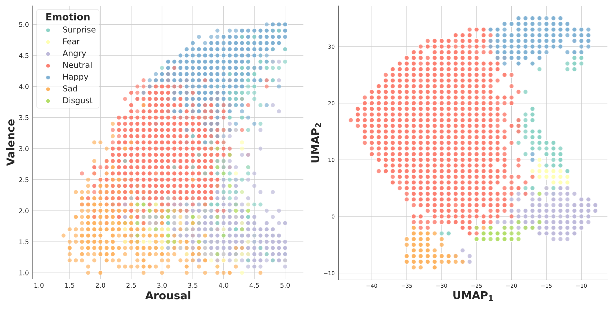
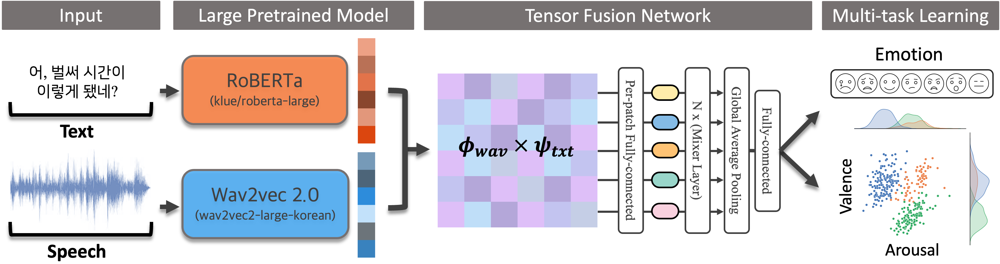
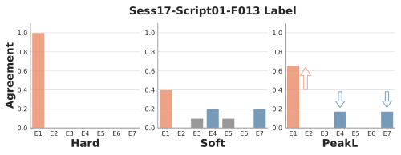
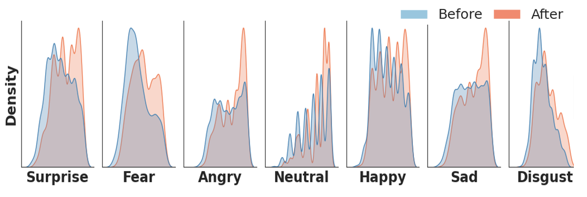

# Improving Multimodal Emotion Recognition using Tensor Mixer Network and Peaking Labels
This repository contains codebase for Improving Multimodal Emotion Recognition using Tensor Mixer Network and Peaking Labels. Our contributions as follows: 
- We predict 7-class emotions and valence & arousal level with multi-modal input: audio and text at the same time, through [**Tensor Mixer Network**](https://aclanthology.org/D17-1115/)
- We propose `PeakL`, Peaking Labels, to make a peak for flattened/vague multi-rated decisions
- Our work also discovered that learned embeddings after proposed **Tensor Mixer Network** aligns on human-rated valence-arousal maps.

---
## Work Summary
### 1. Emotion Distributions and Learned Embeddings
One can easily see their emotion clusters are aligned with human rated valence & arousal space. 
- (Left): Human raters valence & arousal emotion cluster maps.
- (Right): Dimensionality reduction with UMAP of our **Tensor Mixer Network** last linear layer before classification/regression.


### 2. Tensor Mixer Network (TMN)
1. We encode audio and text through pre-trained [wav2vec2](https://huggingface.co/kresnik/wav2vec2-large-xlsr-korean) and [Roberta-large](https://huggingface.co/klue/roberta-large). We pool outputs to produce a single column vector for each data and apply outer products to create modality-fused matrix (tensor-fusion). We feed this matrix to [MLP-mixer](https://arxiv.org/abs/2105.01601) to perform both emotion classification and valence & arousal regression. 


2. Our Tensor Mixer Network (TMN) is competitive compared to other concatenation method in feature vector fusion morphology.

|Fusion Method|Weighted-F1|Micro-F1|CCC(aro)|CCC(val)|
|:------|:----:|:--:|:--:|:--:|
|Concatenation|.827±0.017|.840±0.016|.578±0.115|.688±0.068|
|Cross-attention|.837±0.015|.848±0.016|.810±0.035|.850±0.014|
|**TMN (proposed)**|.844±0.015|.851±0.018|.813±0.011|.857±0.011|  

### 3. Peaking Lables (PeakL)
1. The below equation refers to `PeakL`: $$y^{PeakL} = max(0, y^{soft}-\frac{r}{K})$$ where $r=-\textrm{tanh}(\Sigma{{y^{soft}}{log⁡(y^{soft})}})$ and $K$ is the number of total emotions.


2. Distribution after application are represented in orange and one can observe that these distributions are more left-centered (more certain). Our motivation comes from observation that one-hot classification deters regression performance while using soft-labels with naive raters decision deters classification result.

3. Below figure indicates the distribution before and after applying `PeakL`. 

## Pytorch codebase
### Contents
- [Improving Multimodal Emotion Recognition using Tensor Mixer Network and Peaking Labels](#improving-multimodal-emotion-recognition-using-tensor-mixer-network-and-peaking-labels)
  - [1. Code Structure](#1.-Code-Structure)
  - [2. Code](#2-code)
    - [2.1 Basic Setups](#21-basic-setups)
    - [2.2 Start Training](#22-start-training)
      - [Cold start](#cold-start)
      - [Configure Training](#configure-training)
    - [2.3 Reproduce](#23-reproduce)
  - [3. Miscellaneous](#3-miscellaneous)
    - [Fast Dev](#fast-dev)
    - [Testing Functions with `fire`](#testing-functions-with-fire)
  - [3. Reference](#3-reference)

## 1. Code Structure
Data contains 3 modalities
- `.wav`: Audio file
- `.txt`: Script of an audio
- `.csv`: Electrocardiogram & Electrodermal activity data
```
./
├── README.md
├── config/
├── data/
├── erc/
├── train.py
├── requirements.txt
├── setup.sh
└── train.sh
```

```
./data
├── KEMDy19/
│   ├── ECG/
│   ├── EDA/
│   ├── TEMP/
│   ├── annotation/
│   └── wav/
├── KEMDy20_v1_1/
│   ├── EDA/
│   ├── IBI/
│   ├── TEMP/
│   ├── annotation/
│   └── wav/
```


## 2. Code
### 2.1 Basic Setups
```zsh
(base) conda create -n erc python=3.10
(base) conda activate erc
(erc) chmod +x ./setup.sh
(erc) ./setup.sh
```
- Put data and the source code on the same hierarchy. Prevent hard copy and use soft-link instead: `ln -s ACTUAL_DATA_PATH data`

### 2.2 Start Training
#### Cold start
Easy way to start our training code without configuration changes. Please note that it takes around **6-7 hours on a single RTX 3080**
```zsh
(erc) chmod +x train.sh
(erc) sh train.sh
```
#### Configure Training
We recommend our **dataset to be created before training** (It is possible to train end-to-end with `train.py` script only). We use [`huggingface dataset`](https://huggingface.co/docs/datasets/index) and `.map` function from this library sometimes provokes an unknown error that does not start pre-processing or gets deadlocked when using `num_proc > 1` for multiprocessing. Dataset creation can be done via following commands:
```zsh
python -m fire erc.datasets HF_KEMD --mode=train --validation_fold=${valfold}
python -m fire erc.datasets HF_KEMD --mode=valid --validation_fold=${valfold}
```
With default configuration runs with [config/train.yaml](./config/train.yaml)
```zsh
python train.py
```

We use hydra for CLI execution of training codes. One can add arguments to override values from default configuration via CLI as following
```zsh
python train.py trainer.accelerator=cpu dataset.validation_fold=3
```

### 2.3 Reproduce
To reproduce the full table in our paper, run the following
```bash
(erc) chmod +x reproduce.sh
(erc) sh reproduce.sh
```

## 3. Miscellaneous
### Fast Dev
In cases where GPU is not available or debugging is required, below command reduces number of dataset being forwarded.
```zsh
python train.py dataset.num_data=4 dataloader.batch_size=4 trainer.accelerator=cpu
```
or use `lightning`s' [`fast_dev_run`](https://lightning.ai/docs/pytorch/stable/common/trainer.html#fast-dev-run) flag. (_Runs n if set to n (int) else 1 if set to True batch(es) of train, val and test to find any bugs (ie: a sort of unit test). Default: False._)
```zsh
python train.py +trainer.fast_dev_run=True
```

### Testing Functions with `fire`
One may need to test a specific function on CLI. Writing an extra script for such temporal task is very nagging. Use **`fire` library** to boost-up productivity. For example,
* Create huggingface `datasets`
    ```zsh
    (erc) python -m fire erc.datasets HF_KEMD --dataset_name="kemdy19"
    ```

## Reference
* [Model info](./erc/model/README.md)
* [Competition Links](https://aifactory.space/competition/detail/2234)

---
## Citation
If you find this repository useful in your research, please consider giving a star ⭐ and a citation
```bibtex
@article{PeakL2023,
  title={Improving Multimodal Emotion Recognition using Tensor Mixer Network and Peaking Labels},
  author={Daehyun Cho, Hoe Sung Ryu, Christian Wallraven},
  booktitle={Proceedings of the Korean Information Science Society Conference},
  year={2023}
}
```