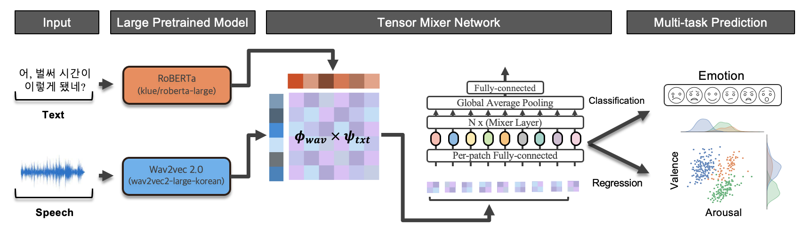

# Multi-modal Emotion Recognition through Tensor Fusion
This repository contains codebase for Multi-modal Emotion Recognition through Tensor Fusion. Our contributions as follows
- We propose `PeakL`, Peaking Labels, to make a peak for flattened/vague multi-rated decisions
- We predict 7-class emotions and valence & arousal level with multi-modal input: audio and text at the same time, through [**Tensor-Fusion**](https://aclanthology.org/D17-1115/)
- Our work also discovered that learned embeddings after proposed **Tensor-Fusion** aligns on human-rated valence-arousal maps.

## Work Summary
### Emotion Distributions and Learned Embeddings
- (Left): Human raters valence & arousal emotion cluster maps.
- (Right): Dimensionality reduction with UMAP of our **Tensor-Fusion** networks last linear layer before classification/regression.

One can easily see their emotion clusters are aligned with human rated valence & arousal space.


### `PeakL` Distributions
Below figure represents the distribution before and after applying `PeakL`. Distribution after application are represented in orange and one can observe that these distributions are more left-centered (more certain). Our motivation comes from observation that one-hot classification deters regression performance while using soft-labels with naive raters decision deters classification result.

Performance comparison between `PeakL` and naive soft-labeling was effective. Results are following.


### Tensor-Fusion Pipeline
We encode audio and text through pre-trained [wav2vec2](https://huggingface.co/kresnik/wav2vec2-large-xlsr-korean) and [Roberta-large](https://huggingface.co/klue/roberta-large). We pool outputs to produce a single column vector for each data and apply outer products to create modality-fused matrix (tensor-fusion). We feed this matrix to [MLP-mixer](https://arxiv.org/abs/2105.01601) to perform both emotion classification and valence & arousal regression. 

Our tensor-fusion is competitive compared to naive simple concatenation not only in feature vector embedding morphology, but also their performance increment was significant under t-test


- [Multi-modal Emotion Recognition through Tensor Fusion](#multi-modal-emotion-recognition-through-tensor-fusion)
  - [Work Summary](#work-summary)
    - [Emotion Distributions and Learned Embeddings](#emotion-distributions-and-learned-embeddings)
    - [`PeakL` Distributions](#peakl-distributions)
    - [Tensor-Fusion Pipeline](#tensor-fusion-pipeline)
  - [1. Data](#1-data)
    - [About Data](#about-data)
  - [2. Code](#2-code)
    - [2.1 Basic Setups](#21-basic-setups)
    - [2.2 Generating Dataset](#22-generating-dataset)
    - [2.3 Start Training](#23-start-training)
  - [3. Miscellaneous](#3-miscellaneous)
    - [Fast Dev](#fast-dev)
    - [Testing Functions with `fire`](#testing-functions-with-fire)
  - [3. Reference](#3-reference)


## 1. Data
### About Data
Data contains 3 modalities
- `.wav`: Audio file
- `.txt`: Script of an audio
- `.csv`: Electrocardiogram & Electrodermal activity data
```
./
├── README.md
├── assets
├── config
├── data
├── erc
├── train.py
├── requirements.txt
├── setup.sh
└── train.sh
```

```
./data
├── KEMDy19
│   ├── ECG
│   ├── EDA
│   ├── TEMP
│   ├── annotation
│   └── wav
├── KEMDy20_v1_1
│   ├── EDA
│   ├── IBI
│   ├── TEMP
│   ├── annotation
│   └── wav
```


## 2. Code
### 2.1 Basic Setups
```zsh
(base) conda create -n erc python=3.10
(base) conda activate erc
(erc) chmod +x ./setup.sh
(erc) ./setup.sh
```
- Put data and the source code on the same hierarchy. Prevent hard copy and use soft-link instead: `ln -s ACTUAL_DATA_PATH data`

### 2.2 Generating Dataset
We recommend our **dataset to be created before training** (It is possible to train end-to-end with `train.py` script only). We use [`huggingface dataset`](https://huggingface.co/docs/datasets/index) and `.map` function from this library sometimes provokes an unknown error that does not start pre-processing or gets deadlocked when using `num_proc > 1` for multiprocessing. Dataset creation can be done via following commands
```zsh
python -m fire erc.datasets HF_KEMD --mode=train --validation_fold=${valfold}
python -m fire erc.datasets HF_KEMD --mode=valid --validation_fold=${valfold}
```

### 2.3 Start Training
With default configuration runs with [config/train.yaml](./config/train.yaml)
```zsh
python train.py
```

We use hydra for CLI execution of training codes. One can add arguments to override values from default configuration via CLI as following
```zsh
python train.py trainer.accelerator=cpu dataset.validation_fold=3
```


## 3. Miscellaneous
### Fast Dev
In cases where GPU is not available or debugging is required, below command reduces number of dataset being forwarded.
```zsh
python train.py dataset.num_data=4 dataloader.batch_size=4 trainer.accelerator=cpu
```
or use `lightning`s' [`fast_dev_run`](https://lightning.ai/docs/pytorch/stable/common/trainer.html#fast-dev-run) flag. (_Runs n if set to n (int) else 1 if set to True batch(es) of train, val and test to find any bugs (ie: a sort of unit test). Default: False._)
```zsh
python train.py +trainer.fast_dev_run=True
```

### Testing Functions with `fire`
One may need to test a specific function on CLI. Writing an extra script for such temporal task is very nagging. Use **`fire` library** to boost-up productivity. For example,
* Create huggingface `datasets`
    ```zsh
    (erc) python -m fire erc.datasets HF_KEMD --dataset_name="kemdy19"
    ```

## 3. Reference
* [Model info](./erc/model/README.md)
* [Competition Links](https://aifactory.space/competition/detail/2234)


Result table 
,T,dof,alternative,p-val,CI95%,cohen-d,BF10,power
epoch/valid_acc,9.7021,4,two-sided,0.0006,[0.01 0.01],0.4927,52.725,0.1379
epoch/valid_macrof1,11.8231,4,two-sided,0.0003,[0.01 0.02],0.7127,92.844,0.2342
epoch/valid_microf1,9.7021,4,two-sided,0.0006,[0.01 0.01],0.4927,52.725,0.1379
epoch/valid_ccc(aro),1.567,4,two-sided,0.1922,[-0.01  0.02],0.6379,0.873,0.1977
epoch/valid_ccc(val),3.6245,4,two-sided,0.0223,[0.   0.02],0.7926,3.958,0.2768
